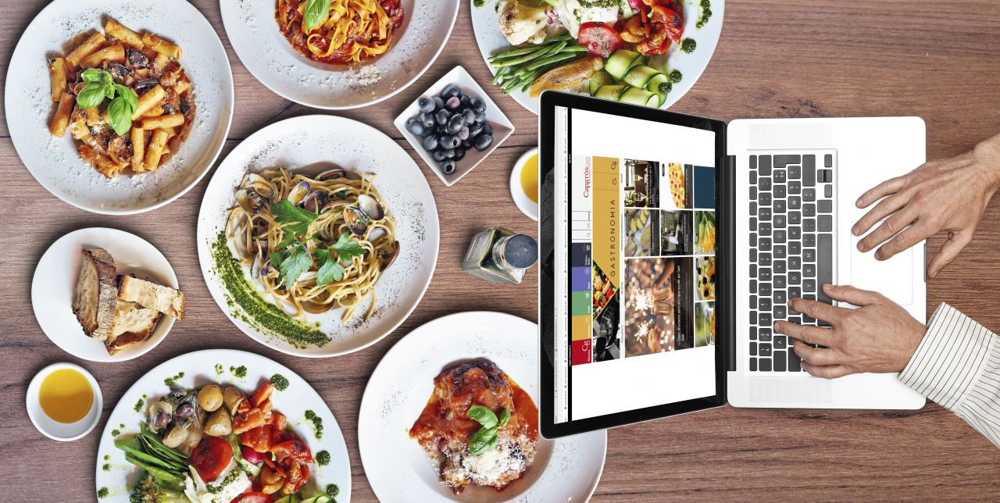
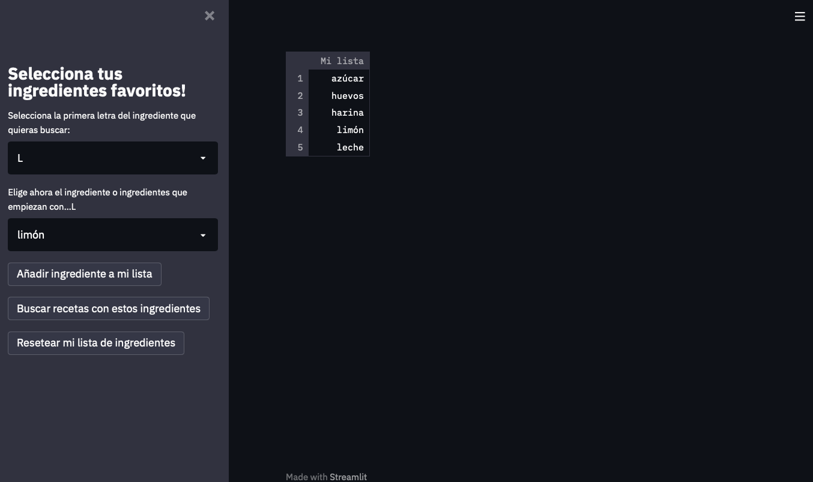
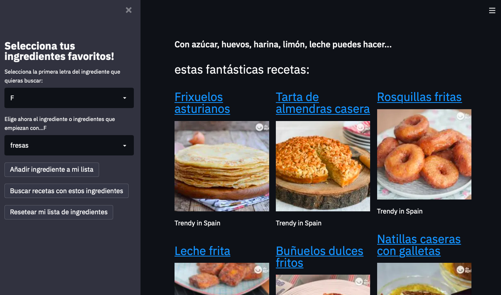
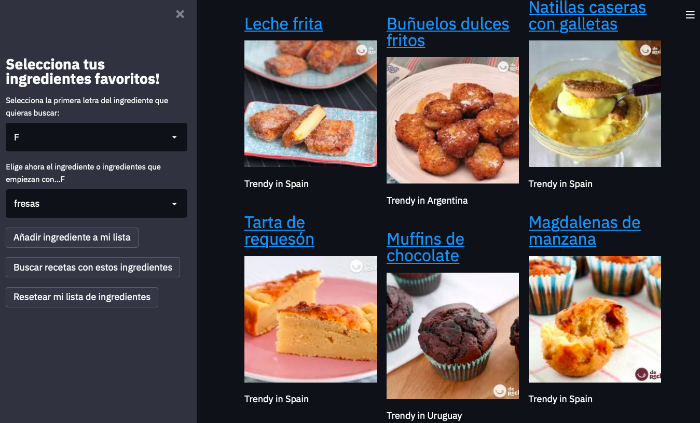

# Proyecto Final
# La Receta más Trendy 🍽

Soy la clase de persona que acude a internet a diario en busca de inspiración en la cocina. Me canso al poco tiempo de los mismos platos y al mismo tiempo mi imaginación es limitada. Siempre surge la misma pregunta: ¿qué puedo hacer con lo que tengo en casa? Asique este proyecto pretende responder a mis propias necesidades.  

Por otro lado, me encanta utilizar GoogleTrends, una herramienta de google que aporta información sobre la tendencia de una busqueda en internet. Y no se puede negar que ultimamente, la comida es un tema muy 'trendy', sobretodo en redes sociales. Me parece muy interesante como ciertas recetas 'se ponen de moda' asique pensé en incluirlo en mi proyecto.

### OBJECTIVO: Crear una aplicación web que, en base a los ingredientes disponibles, sea capaz de proponerte recetas que contengan esos ingredientes. Las recetas aparecerán ordenadas por su orden de tendencia. También se aportará la ubicación global donde se concentra la tendencia en busquedas.

#
Proceso:  

La idea original era extraer los datos de un dataset público. Para mi sorpresa, no encontré más que uno que contuviese recetas en español. Estuve trabajando con este dataset hasta que me dí cuenta de que la información que aportaba no iba a ser suficiente. Asique extraje mis propios datos mediante web-scraping de una web de recetas (www.recetasderechupete.com), web a la que acudo a menudo en busca de ideas. 

1. Web Scraping
2. Limpieza de ingredientes
3. Ponderación de los ingredientes
4. Acceso a la API de Google Trends
5. Desarrollo de la aplicación web

# 

Recursos:
* www.recetasderechupete.com 
* docs.streamlit.io
* towardsdatascience.com/google-trends-api-for-python-a84bc25db88f

# 

Herramientas:
* Python, pandas, streamlit, numpy, regex, BeautifulSoup, requests
* Web Scraping
* API Google Trends
* Streamlit
# 

Producto Final:

Los ingredientes están ordenados por su inicial, el primer paso es seleccionarla. a continuación aparece un segundo desplegable que da opción a selecciónar el ingrediente recorriendo la lista o tecleandolo manualmente.   
El desplegable de ingredientes está ordenado por la ponderación de importancia que recibe el cada ingrediente. Siendo los más relevantes en la cocina los primeros. Para la A por ejemplo: ajo, aceite de oliva, azúcar...etc.  
Los ingredientes seleccionados se almacenan en una lista en la sección de la derecha hasta que se pulsa el potón de busqueda.   

Estas son las recetas que la app propone para la busqueda: azúcar, huevos, harina, limón y leche. Ordenadas de más a menos popular.  
El titulo de la receta es un hipervinculo que te dirige a la pagina original de la receta, con las instrucciones para la misma.   
Podemos observar también a pie de foto, la ubicación del trend. Al estar los nombres de las recetas e ingredientes en castellano, las ubicaciones son sobretodo España y países de América latina.

